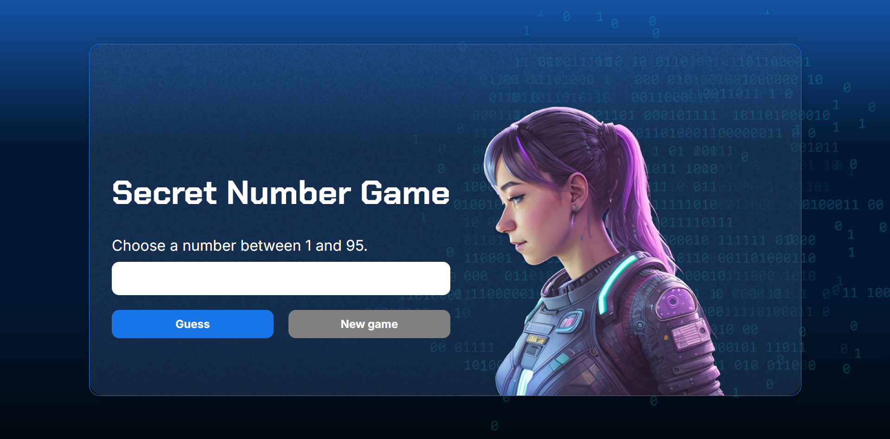

A game that asks you to guess a secret number, made with JavaScript for studies and portfolio purposes only.

[<ins>Click here for live preview!</ins>](https://gummms.github.io/secretNumberGame/)

This is an assignment for the "JS Logic" lessons of ONE: Oracle Next Education program.

